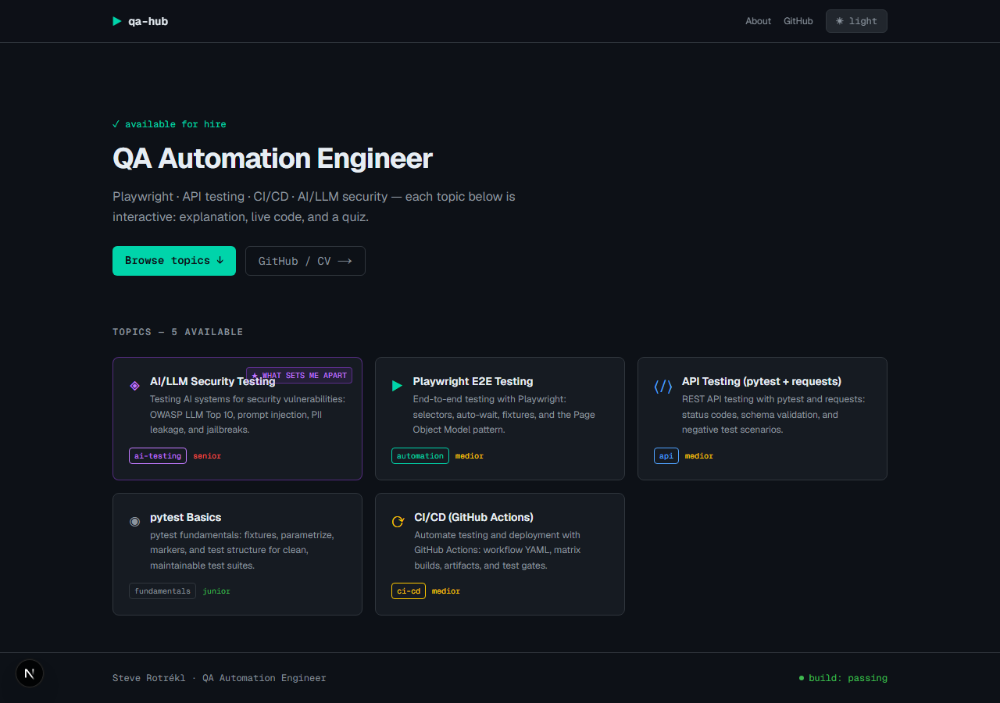
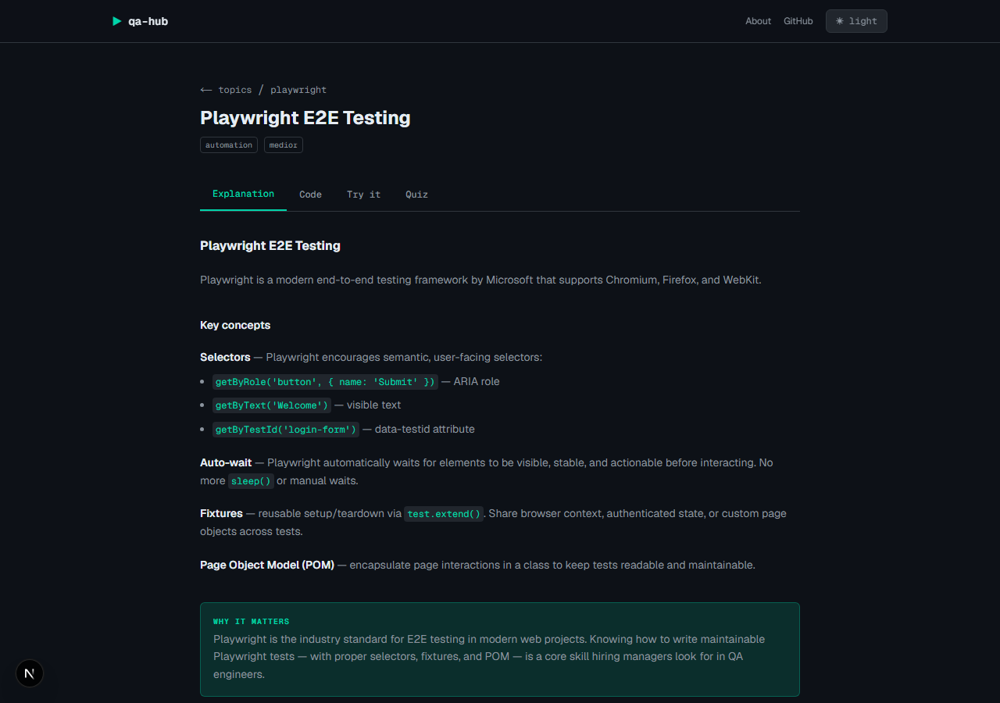
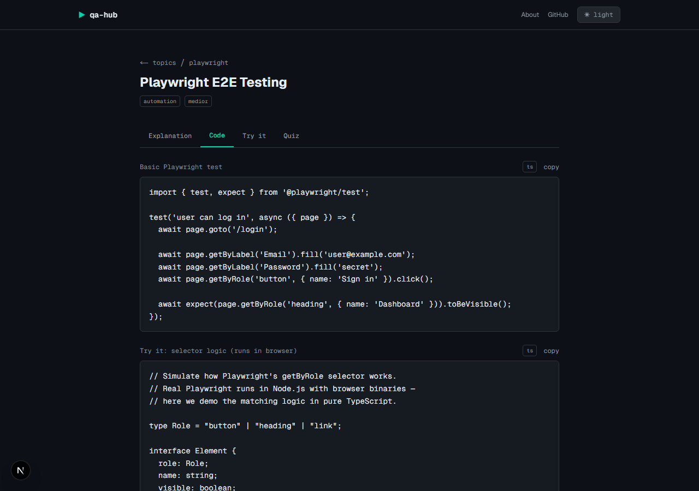
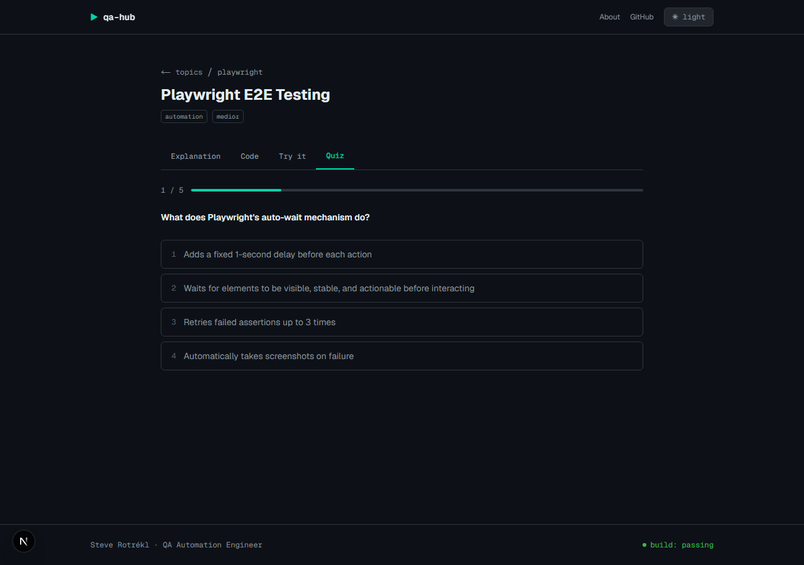

# QA Learning Hub

> Interactive QA automation portfolio - learn by doing, not just reading.

**Live:** [qa-learning-hub.vercel.app](https://qa-learning-hub.vercel.app)

[](https://github.com/Srotrekl/QA-Learning-Hub/actions/workflows/ci.yml)
[](LICENSE)

A portfolio web app demonstrating QA automation skills through interactive topics: each topic has an explanation, live code examples, a runnable sandbox, and a quiz.

**Built for recruiters and hiring managers** looking for QA Automation Engineers with hands-on Playwright, API testing, CI/CD, and AI/LLM security testing skills.

## Screenshots

Dark mode is the default theme (GitHub-dark inspired); a light theme is also available via the toggle in the header.

| Home | Topic — explanation |
| --- | --- |
|  |  |

| Topic — live code | Topic — quiz |
| --- | --- |
|  |  |

## Topics covered

| Topic                           | Category     | Difficulty |
| ------------------------------- | ------------ | ---------- |
| Playwright E2E Testing          | automation   | medior     |
| API Testing (pytest + requests) | api          | medior     |
| AI/LLM Security Testing (*)     | ai-testing   | senior     |
| pytest Basics                   | fundamentals | junior     |
| CI/CD for QA (GitHub Actions)   | ci-cd        | medior     |
| Test Design Techniques          | fundamentals | medior     |
| Bug Reporting & Triage          | fundamentals | junior     |

## Stack

- **Next.js 15** (App Router, SSG) + TypeScript
- **Tailwind CSS v4** + shadcn/ui
- **Sandpack** - live JS/TS code runner in browser
- **Pyodide** - live Python code runner in browser
- **Framer Motion** - subtle animations
- **Vitest** + React Testing Library - component tests
- **Playwright** + axe-core - E2E + accessibility

## Quick start

```bash
npm install
npm run dev
```

Open [http://localhost:3000](http://localhost:3000).

## Scripts

| Command            | Description            |
| ------------------ | ---------------------- |
| `npm run dev`      | Development server     |
| `npm run build`    | Production build       |
| `npm run lint`     | ESLint (zero warnings) |
| `npm run format`   | Prettier format        |
| `npm test`         | Vitest unit tests      |
| `npm run test:e2e` | Playwright E2E tests   |

## Adding a new topic

1. Create `content/topics/your-topic.ts` following the `Topic` type in `lib/types.ts`.
2. No changes to components needed - topics are loaded automatically.

## Known issues (found and fixed via internal QA)

Tracked here as a transparency log rather than hidden in closed issues:

| # | Issue | Area | Status |
| - | ----- | ---- | ------ |
| 1 | `TOTAL_TOPICS` constant in `GlobalProgressBar.tsx` hardcoded to 5, but `content/topics/` had grown to 7 — completion % under-reported | Progress tracking | Fixed — now derived from `getAllSlugs().length` |
| 2 | `Quiz.markCompleted` fired on reaching the last question regardless of `score` — a topic could be marked "done" on a failing attempt | Quiz | Fixed — requires ≥60% score to mark complete |

## Author

Steve Rotrekl - QA Automation Engineer  
[GitHub](https://github.com/Srotrekl) | [LinkedIn](https://linkedin.com/in/steve-rotrekl)
